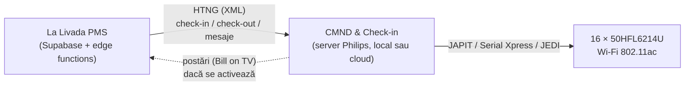
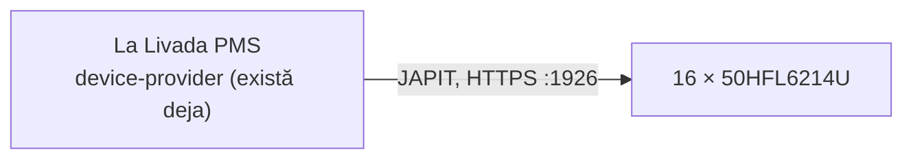

# Integrare PMS ↔ televizoare Philips prin HTNG

Plan de arhitectură, scris pe 11 septembrie 2026. Verificat în
documentația publică disponibilă la acea dată, nu presupus din memorie —
sursele sunt linkuite la fiecare afirmație. **Unde documentația e
închisă sau lipsește, scrie explicit că lipsește, în loc să fie acoperit
cu o afirmație sigură pe ea.**

---

## 0. Concluzia care schimbă cererea — citește asta întâi

**Televizoarele Philips nu vorbesc HTNG.** Niciun model, nici cel montat
la La Livadă.

HTNG e protocolul dintre **PMS** și un **server de management al
camerelor** — la Philips, acela e *CMND & Check-in*. Serverul acela
vorbește mai departe cu televizoarele, în protocoalele lor proprii.
Fișa tehnică a modelului nostru listează exact patru interfețe de
control — **JAPIT, Serial Xpress, JEDI, Crestron Connected** — și **nici
HTNG, nici SICP nu apar printre ele**
([fișa 50HFL6214U/12](https://www.philips.co.uk/p-p/50HFL6214U_12/professional-tv)).

PPDS spune același lucru din partea cealaltă: *„PPDS offers another way
to connect to a PMS with a FIAS and HTNG interface"* — adică FIAS și
HTNG sunt ușa dinspre PMS către platforma lor, nu către aparat
([PPDS](https://www.ppds.com/en-us/insights/ppds-delivers-on-a-suite-of-choice-for-pms-integration-to-the-hospitality-sector)).

Deci cererea, tradusă în ce se poate construi efectiv:

> **La Livada PMS joacă rolul de PMS într-o conversație HTNG cu CMND &
> Check-in, care comandă mai departe televizoarele.**

Vestea bună: cu aparatul pe care îl avem, **asta chiar se poate face**.

---

## 1. Aparatul: 50HFL6214U/12 — confirmat

Model comunicat de proprietar pe 11 septembrie 2026. Verificat pe fișa
oficială; nu mai e o ipoteză.

| | |
|---|---|
| Gamă | **MediaSuite** (seria HFL, profesională) |
| Platformă | **Android TV 9 (Pie)**, Google Play, Chromecast Ultra |
| Streaming | **Netflix integrat**, cu buton dedicat pe telecomandă |
| Management | **CMND & Control** (remote management over IP/RF) |
| Integrare PMS | **CMND & Check-in** — *„guest name, language, messages, and billing functions"* |
| Control | JAPIT (JSON API for TV), Serial Xpress, JEDI, Crestron Connected |
| Rețea | Ethernet RJ-45 · **Wi-Fi 802.11ac** |
| Control extern | RJ-48 (IR In/Out + Serial Xpress) |
| Hotel mode | limitare volum, blocare meniu instalare, welcome app, Bill on TV, express checkout |

**Trei consecințe care contează:**

1. **Varianta A e realizabilă.** CMND & Check-in e suportat pe acest
   model, cu exact câmpurile de care ar avea nevoie o integrare PMS:
   nume, limbă, mesaje, factură.
2. **Netflix e integrat, cu buton pe telecomandă.** Nu e o discuție
   teoretică: oaspeții *se vor* autentifica, iar fără ștergere la
   check-out următorul găsește sesiunea deschisă. Ăsta e cel mai
   serios argument pentru CMND & Check-in — vezi secțiunea 7.
3. **Wi-Fi 802.11ac.** Nu e nevoie de cablu tras în fiecare tiny house,
   ceea ce elimină cea mai scumpă necunoscută a planului inițial.

Un lucru de semnalat, nu de ascuns: **Android TV 9 e din 2018.** În
septembrie 2026 platforma are opt ani. Merită întrebat PPDS până când
mai primește aparatul actualizări de securitate și suport CMND — nu
schimbă planul, dar schimbă cât de mult merită investit în el.

---

## 2. Lanțul, așa cum arată de fapt



Alternativa fără mijlocitor, discutată la secțiunea 6:



---

## 3. Ce vorbește fiecare verigă

| Verigă | Protocol | Transport | Documentație |
|---|---|---|---|
| PMS → CMND | HTNG 2008B (XML asincron) | TCP/HTTP | **închisă** — membri AHLA/HTNG |
| PMS → CMND | FIAS (alternativă la HTNG) | socket text | închisă (Oracle/Fidelio) |
| CMND → TV | **JAPIT** — *JSON API for TV* | HTTPS :1926 (Android TV) | Philips, la cerere; comunitate: [pylips](https://github.com/eslavnov/pylips/blob/master/docs/Home.md) |
| CMND → TV | Serial Xpress (SXP) | RS-232, conector RJ-48 | manual Philips |
| — | Crestron Connected | IP | Crestron, publică |
| — | ~~SICP~~ | — | **nu e pe acest model** (e pentru semnalistică) |

Două precizări care contează:

- **JAPIT pe Android TV folosește HTTPS :1926** și cere împerechere cu
  PIN afișat pe ecran, apoi autentificare digest. Se face o dată per
  aparat, la montaj — dar e un pas manual × 16, nu o configurare de la
  distanță. Porturile vin din documentația comunității; se confirmă în
  cinci minute pe un aparat real.
- **Crestron Connected e a treia cale**, oficială și documentată public,
  dacă JAPIT se dovedește greu de împerecheat. Nu am explorat-o — o
  notez ca ieșire de rezervă, nu ca recomandare.

---

## 4. Varianta A — HTNG către CMND & Check-in (ce s-a cerut)

### 4.1 Ce trimite PMS-ul

Familia de mesaje HTNG 2008B pentru dispozitive de cameră, în termenii
datelor care există azi în bază:

| Eveniment HTNG | Se declanșează când | Din ce câmpuri |
|---|---|---|
| `GuestCheckIn` | oaspetele e **fizic** în cameră | cameră, nume, limbă, data plecării |
| `GuestCheckOut` | status → `checkedout` | cameră |
| `GuestChange` | se schimbă numele, ocupantul sau data plecării | idem check-in |
| `RoomMove` | `roomId` se schimbă pe o rezervare cazată | camera veche + cea nouă |
| `GuestMessage` | recepția trimite un mesaj | cameră, text |
| `PostTransaction` | **de la TV spre PMS** — Bill on TV | — (vezi 4.4) |

### 4.2 Trei capcane care vin din codul existent

Astea trei nu sunt teoretice. Fiecare e o regulă deja scrisă și testată
în acest depozit, pe care o integrare naivă ar încălca-o.

**(a) `checkedin` NU înseamnă „e cineva în cameră".** Recepția poate
face check-in cu până la 14 zile înainte de sosire
(`ZILE_CHECKIN_DEVREME`, [tranzitii.js:22](../src/lib/tranzitii.js:22)).
Un `GuestCheckIn` trimis pe schimbarea de status ar aprinde televizorul
cu „Bine ați venit, domnule Popescu" într-o casă goală, două săptămâni.
Predicatul corect e `cazatAcum(r, now)`
([tranzitii.js:68](../src/lib/tranzitii.js:68)) — exact același pe care
îl folosesc deja automatizările Shelly. **O a doua definiție a lui „e
cazat acum" în aplicație e felul în care cele două ajung să nu mai fie
de acord.**

**(b) Numele de pe ecran e al OCUPANTULUI, nu al titularului.** Într-un
grup, titularul e o singură persoană pentru zece camere. Regula e deja
unică în cod: `occupantName(res, core, groups)`
([nume.js:10](../src/lib/nume.js:10)), folosită de calendar, de liste, de
fișa de cazare și de butonul de WhatsApp. Televizorul trebuie să o
folosească pe aceeași, altfel zece tiny house-uri salută aceeași persoană.

**(c) Limba NU se deduce din țară.** CMND & Check-in primește explicit un
câmp de limbă, dar `guests` nu are așa ceva — are `country`, care e țara
de **domiciliu**. Un român cu domiciliul în Germania ar fi întâmpinat în
germană. E exact greșeala scrisă negru pe alb la naționalitate în
[fisa-cazare.md](fisa-cazare.md) și evitată acolo deliberat. Deci: ori se
adaugă un câmp explicit de limbă pe `guests`, ori televizorul pornește în
română cu engleza la un buton. **Nu deduce.**

### 4.3 Unde intră în cod

Nu se construiește nimic nou de la zero. Tiparul există:

- **`devices` / `device_rooms`** — un televizor devine un rând cu
  `kind = 'tv'`. Legătura multi-la-multi există deja (o folosesc
  releele partajate între două camere).
- **`device-provider`** (edge function) — capătă un provider nou,
  `providers/philips.ts`, lângă `providers/shelly.ts`. Logica pură,
  testabilă din vitest, fără `Deno.*` — la fel ca `reguli-automate.ts`.
- **`cron_reconciliaza`** — bucla de 10 minute care compară starea
  dorită cu cea reală și trimite doar diferențele. Televizoarele intră
  în aceeași buclă. **Nu se face un al doilea scheduler.** Un al doilea
  ceas în aplicație înseamnă două adevăruri despre ce cameră e ocupată.
- **`device_commands`** — jurnalul de comenzi, cu actor. Automatizarea
  scrie deja `Automatizare (sistem)` acolo.

Schema, adăugiri minime:

```sql
-- Ce am trimis deja televizorului, ca reconcilierea sa nu retrimita
-- acelasi mesaj la fiecare tick. Cheia e dispozitivul, nu camera:
-- un televizor mutat intre camere isi pastreaza istoricul.
create table tv_guest_state (
  device_id      text primary key references devices(id) on delete cascade,
  reservation_id text,
  nume_afisat    text,
  limba          text,
  pana_la        timestamptz,
  trimis_la      timestamptz not null default now()
);
```

### 4.4 Ce nu aș activa

- **Bill on TV / express checkout.** Aparatul le suportă, dar ar însemna
  `PostTransaction` în sens invers și expunerea folio-ului pe un ecran
  dintr-o casă detașată, fără recepție la câțiva metri. La 16 unități,
  factura se dă la plecare. Nu merită suprafața de atac — dar e decizia
  ta, nu a mea, și se poate activa oricând ulterior.
- **Wake-up call de pe TV.** Oaspeții au telefoane.

---

## 5. Varianta B — direct pe LAN, fără HTNG și fără CMND

PMS-ul vorbește direct cu televizorul prin **JAPIT**, exact cum vorbește
azi cu releele Shelly: HTTPS pe :1926, digest auth cu credențialele
obținute la împerechere.

Ce se poate face așa: pornit/oprit, volum, sursă/canal la pornire,
**mesaj pe ecran**, revenire la starea inițială la plecare.

Ce **nu** se poate: ștergerea garantată a credențialelor Netflix și a
sesiunii Chromecast la check-out — chiar funcția pentru care Philips
vinde CMND & Check-in. Nici meniu hotelier brandat, nici actualizări
centralizate.

Cost: zero licențe, zero server nou, ~o săptămână de lucru, refolosind
`device-provider` aproape integral.

Riscul real: **JAPIT nu are documentație publică.** Philips o dă la
cerere; restul e documentat de comunitate. O actualizare de firmware îl
poate schimba — deși pe Android 9, în 2026, riscul ăsta e mai degrabă
mic decât mare.

---

## 6. Comparație

| | A — HTNG + CMND | B — direct JAPIT |
|---|---|---|
| Suportat oficial | da | parțial (API la cerere) |
| Licențe | CMND & Check-in | niciuna |
| Server nou | da | nu |
| **Netflix șters la check-out** | **da** | **nu** |
| Mesaj de bun venit cu numele | da | da |
| Efort | luni, dependent de PPDS | ~1 săptămână |

---

## 7. Recomandare

**Modelul schimbă recomandarea față de prima variantă a acestui
document.**

Când nu știam ce aparate sunt, spuneam: începe cu B, treci la A doar
dacă apare un motiv concret. **Motivul acela e acum pe masă:
50HFL6214U are Netflix integrat, cu buton dedicat pe telecomandă.**

Un oaspete care se autentifică la Netflix și pleacă își lasă contul
deschis pentru următorul. Nu e o ipoteză — e comportamentul implicit al
aparatului. Ștergerea garantată a credențialelor la check-out e exact
funcția pentru care există CMND & Check-in, și e singurul lucru din
varianta A pe care varianta B nu-l poate face.

Deci:

- **Dacă lași Netflix activ** → merită CMND & Check-in, adică varianta A.
- **Dacă dezactivezi Netflix** din meniul hotelier și lași doar
  Chromecast (care se asociază per sesiune și e mai ușor de resetat) →
  varianta B acoperă restul, cu o săptămână de lucru și zero licențe.

Asta e o decizie comercială, nu tehnică: cât valorează Netflix în camera
pentru oaspeții tăi față de prețul licenței. Eu n-o pot lua. Ce pot
spune e că **a lăsa Netflix activ fără ștergere la check-out e singura
variantă care nu e în regulă** — acolo primul oaspete plătește
abonamentul pentru toți ceilalți.

---

## 8. Etape livrabile

| # | Ce | Livrabil singur | Depinde de |
|---|---|---|---|
| 0 | ~~Inventar: ce televizoare~~ | **făcut** — 50HFL6214U/12 | — |
| 1 | Cerere la PPDS: interfața PMS + documentația JAPIT + preț CMND & Check-in | da | — |
| 2 | Un televizor de probă, împerecheat, comandat din `curl` | da | — |
| 3 | `providers/philips.ts` + `kind = 'tv'` în `devices` | da | 2 |
| 4 | Mesaj de bun venit la sosirea reală (`cazatAcum`) | da | 3 |
| 5 | Revenire la starea inițială la check-out | da | 3 |
| 6 | Varianta A, dacă se decide Netflix: HTNG către CMND | nu | 1 |

Etapele 1 și 2 nu cer nicio schimbare în cod și se pot face săptămâna
asta. Ele decid restul.

---

## 9. Ce nu am verificat

Spus pe față, ca să nu fie luat drept sigur:

- **Nu am văzut specificația HTNG.** E pentru membri AHLA. Numele de
  mesaje din tabelul 4.1 sunt din familia 2008B așa cum e descrisă
  public de [Oracle](https://docs.oracle.com/cd/E53547_01/opera_5_04_03_core_help/21401.htm)
  și de HTNG, nu copiate dintr-un document de interfață. **Se confirmă
  din documentul PPDS, la etapa 1.**
- **Nu am văzut documentația de integrare PMS a CMND.** Pagina
  [pms.cmnd.pro](https://pms.cmnd.pro/information/) e de marketing:
  nici protocoale, nici porturi, nici formate de mesaj.
- **Nu am văzut specificația JAPIT.** Fișa aparatului o listează ca
  interfață suportată; documentul în sine e la cerere de la Philips.
- **Portul 1926 vine din documentația comunității**, nu dintr-un manual
  Philips. Se confirmă pe un aparat real, la etapa 2.
- **Nu știu câte televizoare sunt montate** — planul presupune unul per
  unitate, adică 16.
- **Nu știu până când mai primește Android TV 9 actualizări** pe acest
  model. De întrebat la etapa 1.
