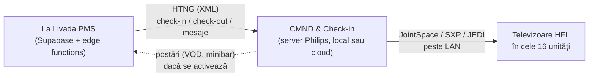
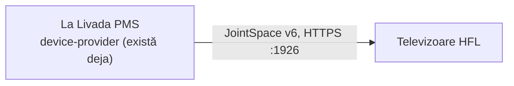

# Integrare PMS ↔ televizoare Philips prin HTNG

Plan de arhitectură, scris pe 11 septembrie 2026. Verificat în
documentația publică disponibilă la acea dată, nu presupus din memorie —
sursele sunt linkuite la fiecare afirmație. **Unde documentația e
închisă sau lipsește, scrie explicit că lipsește, în loc să fie acoperit
cu o afirmație sigură pe ea.**

---

## 0. Concluzia care schimbă cererea — citește asta întâi

**Televizoarele Philips nu vorbesc HTNG.** Niciun model, nici
MediaSuite, nici Signature.

HTNG e protocolul dintre **PMS** și un **server de management al
camerelor** — la Philips, acela e *CMND & Check-in*. Serverul acela
vorbește mai departe cu televizoarele, în protocoalele lor proprii
(JointSpace/JAPIT, Serial Xpress, JEDI). Manualul MediaSuite listează
exact astea trei ca interfețe de control ale televizorului — HTNG nu
apare nicăieri în el ([manual
MediaSuite](https://manuals.plus/philips/32hfl5014-12-32-inch-mediasuite-professional-tv-manual)).

PPDS spune același lucru din partea cealaltă: *„PPDS offers another way
to connect to a PMS with a FIAS and HTNG interface"* — adică FIAS și
HTNG sunt ușa dinspre PMS către platforma lor, nu către aparat
([PPDS](https://www.ppds.com/en-us/insights/ppds-delivers-on-a-suite-of-choice-for-pms-integration-to-the-hospitality-sector)).

Deci cererea, tradusă în ce se poate construi efectiv:

> **La Livada PMS joacă rolul de PMS într-o conversație HTNG cu CMND &
> Check-in, care comandă mai departe televizoarele.**

Asta se poate face. Dar nu e singura cale, iar pentru 16 unități
detașate probabil nici cea potrivită — vezi secțiunea 6.

---

## 1. Lanțul, așa cum arată de fapt



Alternativa fără mijlocitor, discutată la secțiunea 6:



---

## 2. Ce vorbește fiecare verigă

| Verigă | Protocol | Transport | Documentație |
|---|---|---|---|
| PMS → CMND | HTNG 2008B (XML asincron) | TCP/HTTP | **închisă** — membri AHLA/HTNG |
| PMS → CMND | FIAS (alternativă la HTNG) | socket text | închisă (Oracle/Fidelio) |
| CMND → TV | JointSpace / JAPIT | HTTPS :1926 (Android), HTTP :1925 | comunitate, [pylips](https://github.com/eslavnov/pylips/blob/master/docs/Home.md) |
| CMND → TV | Serial Xpress (SXP) | RS-232, conector RJ-48 | manual Philips |
| Semnalistică (nu HFL) | SICP | TCP :5000 | [SICP v2.03](https://community.xibo.org.uk/uploads/short-url/vwVq2nPyhJKL4kTCYpa6VYhQUa8.pdf) |

Două precizări care contează:

- **SICP e pentru display-uri de semnalistică**, nu pentru televizoarele
  hoteliere HFL. Portul 5000 e real și documentat, dar pe altă familie de
  aparate. Nu construi pe el fără să confirmi pe modelul cumpărat.
- **JointSpace v6 cere împerechere cu PIN** afișat pe ecran, apoi
  autentificare digest. Se face o dată per aparat, la montaj — dar e un
  pas manual × 16, nu o configurare de la distanță.

---

## 3. Ce trebuie stabilit înainte de orice linie de cod

Astea nu sunt formalități: fiecare dintre ele poate anula planul.

1. **Ce televizoare există sau se cumpără?** Un televizor Philips *de
   consum* nu are nimic din ce scrie mai sus — fără CMND, fără profil
   hotelier, fără welcome message. E nevoie de seria **HFL**
   (MediaSuite / Signature). Dacă în tiny house-uri sunt televizoare
   normale, planul începe cu o achiziție, nu cu un API.
2. **Există CMND & Check-in, sau doar CMND?** CMND simplu (conținut și
   configurare) nu face check-in. Integrarea PMS e modul licențiat
   separat.
3. **Rețea în fiecare unitate.** Cele 14 tiny house-uri sunt clădiri
   separate. Există deja curent și rețea în cele 7 camere tehnice (vezi
   [shelly-integration.md](shelly-integration.md)), dar televizorul are
   nevoie de LAN sau Wi-Fi *stabil* în locuință, nu în camera tehnică.
4. **Specificația HTNG.** HTNG a intrat sub AHLA, iar specificațiile sunt
   pentru membri. Fără documentul de interfață de la PPDS, „implementez
   HTNG" nu e o sarcină — e o ghicitoare. **Primul pas real al acestui
   plan e un e-mail către PPDS prin care ceri documentul de integrare
   PMS.**

Până la răspunsurile de mai sus, restul planului e scris sub ipoteza:
*televizoare MediaSuite HFL, CMND & Check-in licențiat, rețea în
fiecare unitate.*

---

## 4. Varianta A — HTNG către CMND & Check-in (ce s-a cerut)

### 4.1 Ce trimite PMS-ul

Familia de mesaje HTNG 2008B pentru dispozitive de cameră, în termenii
datelor care există azi în bază:

| Eveniment HTNG | Se declanșează când | Din ce câmpuri |
|---|---|---|
| `GuestCheckIn` | oaspetele e **fizic** în cameră | cameră, nume, limbă, data plecării |
| `GuestCheckOut` | status → `checkedout` | cameră |
| `GuestChange` | se schimbă numele, ocupantul sau data plecării | idem check-in |
| `RoomMove` | `roomId` se schimbă pe o rezervare cazată | camera veche + cea nouă |
| `GuestMessage` | recepția trimite un mesaj | cameră, text |
| `PostTransaction` | **de la TV spre PMS** — VOD, minibar | — (nu se folosește, vezi 4.4) |

### 4.2 Trei capcane care vin din codul existent

Astea trei nu sunt teoretice. Fiecare e o regulă deja scrisă și testată
în acest depozit, pe care o integrare naivă ar încălca-o.

**(a) `checkedin` NU înseamnă „e cineva în cameră".** Recepția poate
face check-in cu până la 14 zile înainte de sosire
(`ZILE_CHECKIN_DEVREME`, [tranzitii.js](../src/lib/tranzitii.js:22)).
Un `GuestCheckIn` trimis pe schimbarea de status ar aprinde televizorul
cu „Bine ați venit, domnule Popescu" într-o casă goală, două săptămâni.
Predicatul corect e `cazatAcum(r, now)`
([tranzitii.js:68](../src/lib/tranzitii.js:68)) — exact același pe care
îl folosesc deja automatizările Shelly. **O a doua definiție a lui „e
cazat acum" în aplicație e felul în care cele două ajung să nu mai fie
de acord.**

**(b) Numele de pe ecran e al OCUPANTULUI, nu al titularului.** Într-un
grup, titularul e o singură persoană pentru zece camere. Regula e deja
unică în cod: `occupantName(res, core, groups)`
([nume.js:10](../src/lib/nume.js:10)), folosită de calendar, de liste, de
fișa de cazare și de butonul de WhatsApp. Televizorul trebuie să o
folosească pe aceeași, altfel zece tiny house-uri salută aceeași persoană.

**(c) Limba NU se deduce din țară.** `guests` nu are câmp de limbă — are
`country`, care e țara de **domiciliu**. Un român cu domiciliul în
Germania ar fi întâmpinat în germană. E exact greșeala scrisă negru pe
alb la naționalitate în [fisa-cazare.md](fisa-cazare.md) și evitată
acolo deliberat. Deci: ori se adaugă un câmp explicit de limbă pe
`guests`, ori televizorul pornește în română cu engleza la un buton.
**Nu deduce.**

### 4.3 Unde intră în cod

Nu se construiește nimic nou de la zero. Tiparul există:

- **`devices` / `device_rooms`** — un televizor devine un rând cu
  `kind = 'tv'`. Legătura multi-la-multi există deja (o folosesc
  releele partajate între două camere).
- **`device-provider`** (edge function) — capătă un provider nou,
  `providers/philips.ts`, lângă `providers/shelly.ts`. Logica pură,
  testabilă din vitest, fără `Deno.*` — la fel ca `reguli-automate.ts`.
- **`cron_reconciliaza`** — bucla de 10 minute care compară starea
  dorită cu cea reală și trimite doar diferențele. Televizoarele intră
  în aceeași buclă. **Nu se face un al doilea scheduler.** Un al doilea
  ceas în aplicație înseamnă două adevăruri despre ce cameră e ocupată.
- **`device_commands`** — jurnalul de comenzi, cu actor. Automatizarea
  scrie deja `Automatizare (sistem)` acolo.

Schema, adăugiri minime:

```sql
-- Ce am trimis deja televizorului, ca reconcilierea sa nu retrimita
-- acelasi mesaj la fiecare tick. Cheia e dispozitivul, nu camera:
-- un televizor mutat intre camere isi pastreaza istoricul.
create table tv_guest_state (
  device_id   text primary key references devices(id) on delete cascade,
  reservation_id text,
  nume_afisat text,
  limba       text,
  pana_la     timestamptz,
  trimis_la   timestamptz not null default now()
);
```

### 4.4 Ce NU se face

- **Bill on TV / express checkout.** Ar însemna `PostTransaction` în
  sens invers și expunerea folio-ului pe un ecran dintr-o casă
  detașată. La 16 unități, factura se dă la plecare, la recepție. Nu
  merită suprafața de atac.
- **VOD.** Nu există conținut de vândut.
- **Wake-up call de pe TV.** Oaspeții au telefoane.

---

## 5. Varianta B — direct pe LAN, fără HTNG și fără CMND

PMS-ul vorbește direct cu televizorul, exact cum vorbește azi cu
releele Shelly: JointSpace v6, HTTPS pe :1926, digest auth cu
credențialele obținute la împerechere.

Ce se poate face așa: pornit/oprit, volum, canal/sursă la pornire,
**mesaj pe ecran**, resetare la starea inițială la plecare.

Ce **nu** se poate: ștergerea garantată a credențialelor Netflix la
check-out (asta e chiar funcția pentru care Philips vinde CMND &
Check-in), meniu hotelier brandat, actualizări de firmware
centralizate.

Cost: zero licențe, zero server nou, ~o săptămână de lucru, și refolosind
`device-provider` aproape integral.

Riscul real: **JointSpace nu e un API public susținut de Philips.** E
documentat de comunitate. O actualizare de firmware îl poate schimba,
și n-ai la cine reclama.

---

## 6. Comparație și recomandare

| | A — HTNG + CMND | B — direct JointSpace |
|---|---|---|
| Suportat oficial | da | nu |
| Licențe | CMND & Check-in | niciuna |
| Server nou | da | nu |
| Netflix șters la check-out | da | nu garantat |
| Efort | luni, dependent de PPDS | ~1 săptămână |
| Documentație necesară | închisă, se cere | publică |

**Recomandarea mea: începe cu B, și treci la A doar dacă apare un motiv
concret** — cel mai probabil Netflix, dacă vrei ca oaspeții să se
conecteze cu contul lor fără ca următorul să le găsească sesiunea.
Ăsta chiar e un motiv serios, și e singurul pentru care aș cheltui pe
CMND & Check-in.

Pentru 16 unități detașate, un lanț PMS → HTNG → CMND → TV e o
infrastructură de hotel de 200 de camere pusă să facă un lucru pe care
îl face o cerere HTTPS. Aceeași judecată ca la Shelly: *nimic
„enterprise" de dragul lui enterprise*.

Dacă preferi totuși A — pentru că vrei suport oficial și nu vrei să
depinzi de un API de comunitate — e o alegere legitimă, și planul de la
secțiunea 4 stă în picioare. Spune-mi și îl duc mai departe.

---

## 7. Etape livrabile

| # | Ce | Livrabil singur | Depinde de |
|---|---|---|---|
| 0 | Inventar: ce televizoare, ce rețea în unități | da | — |
| 1 | Cerere de documentație către PPDS (interfața PMS) | da | 0 |
| 2 | Un televizor de probă, împerecheat, comandat din `curl` | da | 0 |
| 3 | `providers/philips.ts` + `kind = 'tv'` în `devices` | da | 2 |
| 4 | Mesaj de bun venit la sosirea reală (`cazatAcum`) | da | 3 |
| 5 | Resetare la check-out | da | 3 |
| 6 | Varianta A, dacă se decide: HTNG către CMND | nu | 1 |

Etapele 0–2 nu cer nicio schimbare în cod și se pot face săptămâna
asta. Ele decid restul.

---

## 8. Ce nu am verificat

Spus pe față, ca să nu fie luat drept sigur:

- **Nu am văzut specificația HTNG.** E pentru membri AHLA. Numele de
  mesaje din tabelul 4.1 sunt din familia 2008B așa cum e descrisă
  public de Oracle și de HTNG, nu copiate dintr-un document de
  interfață. **Se confirmă din documentul PPDS, la etapa 1.**
- **Nu am văzut documentația de integrare PMS a CMND.** Pagina
  [pms.cmnd.pro](https://pms.cmnd.pro/information/) e de marketing:
  nici protocoale, nici porturi, nici formate de mesaj.
- **Nu știu ce televizoare sunt montate la La Livadă.** Nimic din depozit
  nu pomenește vreunul.
- **Porturile 1925/1926 sunt din documentația comunității**, nu dintr-un
  manual Philips. Se confirmă în cinci minute pe un aparat real, la
  etapa 2.
